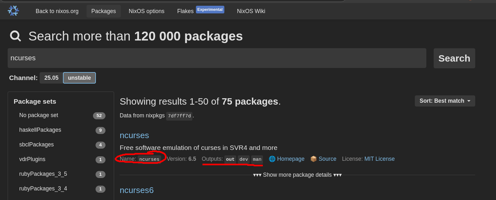

# Developing

You will need at least 30GB of storage available (these are some heavy dependencies!).

## On Linux-based systems (not NixOS)

With Docker installed, run the following command inside the Azurebot_OpenRM folder:
```
docker run -v $(pwd):/app \ # Allows the container access to the current directory
    --rm -it \              # --rm deletes the container when done, and -it = interactive terminal
    REPLACE_ME              # TODO: replace with actual docker image once we have that
```

This will drop you into a bash shell with all the dependencies and build tools preconfigured.

## On NixOS

Run:
```
nix develop .#cuda
```

## On other systems (MacOS/Windows)

Install docker desktop

// todo: describe the virtual desktop 

You can now view the screen of the Linux container by visiting `http://localhost:5009` in your browser. The VNC password is `openrm`

# Building the Container

If you would like to rebuild the container from source (i.e. when adding a dependency to the nix store), do the following:

> [!NOTE] You will need both Docker and the Nix package manager installed.

Inside of the `Azurebot_OpenRM` folder, run the following command:

```
nix run .#openrm-cuda.copyToDockerDaemon
```

and the container will build. You may recieve an error like this:

```
warning: Git tree '/home/derock/Documents/Code/Duke/Clubs/Azurebot_OpenRM' is dirty
evaluation warning: in docker image openrm-dev: The contents parameter is deprecated. Change to copyToRoot if the contents are designed to be copied to the root filesystem, such as when you use `buildEnv` or similar between contents and your packages. Use copyToRoot = buildEnv { ... }; or similar if you intend to add packages to /bin.
error: builder for '/nix/store/sgnrkik0gdnjx47h62y5nwqh6m67jqs8-TensorRT-10.9.0.34.Linux.x86_64-gnu.cuda-12.8.tar.gz.drv' failed with exit code 1;
       last 13 log lines:
       >
       > ***
       > To use the TensorRT derivation, you must join the NVIDIA Developer Program and
       > download the 10.9.0.34 TAR package for CUDA 12.8 from
       >sdf https://developer.nvidia.com/tensorrt.
       >
       > Once you have downloaded the file, add it to the store with the following
       > command, and try building this derivation again.
       >
       > $ nix-store --add-fixed sha256 TensorRT-10.9.0.34.Linux.x86_64-gnu.cuda-12.8.tar.gz
       >
       > ***
       >
       For full logs, run:
         nix log /nix/store/sgnrkik0gdnjx47h62y5nwqh6m67jqs8-TensorRT-10.9.0.34.Linux.x86_64-gnu.cuda-12.8.tar.gz.drv
error: 1 dependencies of derivation '/nix/store/8p1cmr4r1vjm9dcy9mialzihn0186bjr-tensorrt-10.9.0.34.drv' failed to build
error: 1 dependencies of derivation '/nix/store/yd09p1j90d9bx5q6afqqlsrdajp33w3x-docker-layer-openrm-dev.drv' failed to build
error: 1 dependencies of derivation '/nix/store/qp5dc7wai00m07kcll0c6ffc5srq31n8-docker-image-openrm-dev.tar.gz.drv' failed to build
```

Do as the error says. You need to visit the developer.nvidia.com page and download the correct tensorrt version. In the case of this error, it is requesting version 10.9 for cuda 12.8. Download the .tar.gz file, and run the command in your Downloads folder.

After this, you can re-run the initial command. This will build and tag a docker image as `openrm-dev:cuda`.

# Installing dependencies

Visit https://search.nixos.org and look for the package you want. Copy the name and place it into the `flake.nix` under the `buildInputs` array.

Some packages will have an "Outputs" list on the NixOS search:



If this is a DEVELOPMENT library (i.e. you want the headers) and the outputs list contains one named `dev`, add a `.dev` to the end of the name. So in this case, instead of adding just `ncurses` to the `buildInputs` array, you would want to add `ncurses.dev`. If you do not see an "Outputs" list, or if you do not see a "dev" output, you can put just the package name into the array. Only some packages have separate dev versions.

You will now need to rebuild the docker image. See the above section on how to do that.

# Updating dependencies

With the nix package manager installed, you can run `nix flake update` inside of the Azurebot_OpenRM directory to update all dependencies. You will need to rebuild the image after doing that.
